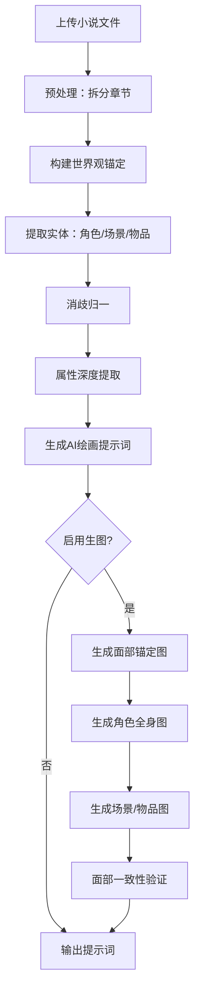

## 1. 产品概述

AI拆书生图 — 将中文小说原文自动拆解为人物、场景、物品的AI绘画提示词，并生成风格统一、面部一致的插图。

* 目标用户：小说爱好者、插画师、自媒体创作者

* 核心价值：从文本到图片的全自动流水线，世界观统一 + 面部一致性锁定

## 2. 核心功能

### 2.1 功能模块

1. **工作台页面**：项目管理、文件上传、流水线执行、全局进度
2. **世界观页面**：世界观锚定文档查看与编辑
3. **实体页面**：角色/场景/物品的卡片列表、详情、属性编辑、提示词查看
4. **图集页面**：所有生成图片的画廊、大图预览、下载

### 2.2 页面详情

| 页面名称 | 模块名称  | 功能描述                     |
| ---- | ----- | ------------------------ |
| 工作台  | 项目列表  | 左侧边栏显示所有项目，支持创建/切换/删除    |
| 工作台  | 文件上传  | 拖拽上传TXT/EPUB文件，自动创建项目    |
| 工作台  | 流水线控制 | 一键运行/分阶段运行/中断恢复，实时进度条    |
| 工作台  | 统计概览  | 角色/场景/物品数量、已生成图片数、当前阶段   |
| 世界观  | 世界框架  | 类型、时代、力量体系、社会结构展示        |
| 世界观  | 视觉锚定  | 画风、色彩体系、光影风格、禁止元素展示      |
| 世界观  | 面部规范  | 面部风格、服饰体系、发型规则展示         |
| 实体   | 角色列表  | 卡片网格展示，支持搜索筛选            |
| 实体   | 角色详情  | 属性面板 + 面部锚定图 + 全身图 + 提示词 |
| 实体   | 场景列表  | 大图卡片展示                   |
| 实体   | 物品列表  | 小卡片网格展示                  |
| 图集   | 图片画廊  | 瀑布流/网格展示所有生成图片           |
| 图集   | 大图预览  | 点击放大，显示提示词和实体信息          |
| 设置   | API配置 | LLM API Key、生图后端配置、连接测试  |
| 设置   | 输出设置  | 输出目录、格式、参数调整             |

## 3. 核心流程



## 4. 用户界面设计

### 4.1 设计风格

* **整体风格**：深色系专业工具风，类似 Figma/Notion 的沉浸式工作台

* **主色调**：深灰底 (#0f0f0f) + 暖橙点缀 (#f97316) + 白色文字

* **次色调**：卡片背景 (#1a1a1a)、边框 (#2a2a2a)、悬停 (#333333)

* **字体**：中文用系统默认，英文用 JetBrains Mono（代码/提示词区域）

* **按钮风格**：圆角8px，主按钮实心橙，次按钮描边

* **布局风格**：固定视口，左侧240px固定侧边栏，右侧内容区内部滚动

* **图标**：lucide-react 图标库

### 4.2 页面设计概览

| 页面名称 | 模块名称 | UI元素                |
| ---- | ---- | ------------------- |
| 工作台  | 侧边栏  | 深色背景、项目列表、新建按钮、设置入口 |
| 工作台  | 顶部栏  | 面包屑、运行按钮、进度条        |
| 工作台  | 统计卡片 | 3列网格，图标+数字+标签       |
| 世界观  | 世界框架 | 分组卡片，标签式展示          |
| 世界观  | 视觉锚定 | 色彩色块、关键词标签          |
| 实体   | 卡片网格 | 4列网格，图片+名称+类型标签     |
| 实体   | 详情面板 | 右侧滑出抽屉，属性表格+图片+提示词  |
| 图集   | 画廊   | 等宽网格，hover放大效果      |
| 设置   | 表单   | 分组表单，输入框+下拉+开关      |

### 4.3 响应式

* 桌面优先设计，最小视口 1280x720

* 固定视口布局：侧边栏固定宽度，内容区自适应

* 内容区内部滚动，页面整体不滚动

### 4.4 固定视口布局

```
┌──────────────────────────────────────────────────────────┐
│ 顶部栏 (56px固定)                                        │
├──────────┬───────────────────────────────────────────────┤
│ 侧边栏    │ 内容区 (内部滚动)                              │
│ 240px    │                                               │
│ 固定      │                                               │
│          │                                               │
│          │                                               │
│          │                                               │
│          │                                               │
│          │                                               │
└──────────┴───────────────────────────────────────────────┘
```

* 整体 `height: 100vh; overflow: hidden`

* 侧边栏 `position: fixed; height: calc(100vh - 56px)`

* 内容区 `overflow-y: auto; height: calc(100vh - 56px)`

