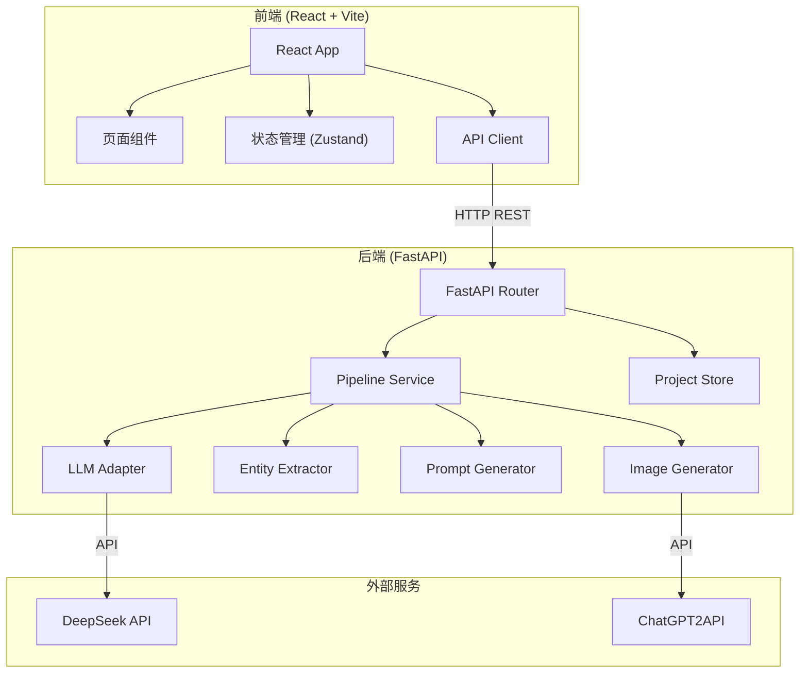
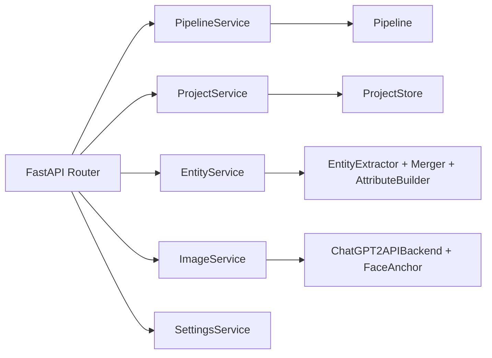

## 1. 架构设计



## 2. 技术说明

- **前端**：React@18 + TypeScript + Vite + Tailwind CSS + Zustand
- **初始化工具**：vite-init (react-ts template)
- **后端**：FastAPI (Python)，复用现有 src/ 模块
- **数据库**：文件系统 (JSON存储)，复用现有 ProjectStore
- **通信**：REST API + SSE (Server-Sent Events 用于进度推送)

## 3. 路由定义

| 路由 | 用途 |
|------|------|
| `/` | 工作台首页（项目列表 + 统计概览） |
| `/project/:id` | 项目详情（世界观 + 实体 + 图集） |
| `/settings` | 设置页面 |

## 4. API 定义

### 4.1 项目管理

```typescript
// GET /api/projects - 获取项目列表
interface Project {
  id: string;
  name: string;
  novel_name: string;
  status: "idle" | "running" | "completed" | "error";
  created_at: string;
  stats: { characters: number; scenes: number; items: number; images: number };
}

// POST /api/projects - 创建项目（上传文件）
// multipart/form-data: file + name

// GET /api/projects/:id - 获取项目详情

// DELETE /api/projects/:id - 删除项目
```

### 4.2 流水线

```typescript
// POST /api/projects/:id/pipeline - 运行流水线
interface PipelineRequest {
  stages?: string[]; // 可选：指定阶段
  enable_image?: boolean;
}

// GET /api/projects/:id/pipeline/status - 获取进度 (SSE)
interface PipelineProgress {
  stage: string;
  progress: number; // 0.0 - 1.0
  message: string;
  is_running: boolean;
}
```

### 4.3 世界观

```typescript
// GET /api/projects/:id/world-bible - 获取世界观
interface WorldBibleResponse {
  world_framework: {
    genre: string;
    sub_genre: string;
    era_setting: string;
    technology_level: string;
    power_system: string;
    social_structure: string;
    geography_overview: string;
    key_concepts: string[];
    tone_and_mood: string;
  };
  visual_anchoring: {
    art_style: string;
    color_palette: { primary: string; secondary: string; accent: string; atmosphere: string };
    lighting_style: string;
    texture_style: string;
    atmosphere_keywords: string[];
    forbidden_elements: string[];
  };
  character_visual_rules: { face_style: string; clothing_system: string; hairstyle_rules: string };
  scene_visual_rules: { architecture_style: string; landscape_style: string };
  item_visual_rules: { weapon_style: string; material_system: string };
}
```

### 4.4 实体

```typescript
// GET /api/projects/:id/entities?type=character|scene|item - 获取实体列表
interface Entity {
  id: string;
  name: string;
  aliases: string[];
  type: "character" | "scene" | "item";
  brief_description: string;
  source_quotes: { text: string; chapter: string }[];
  attributes: Record<string, any>;
  has_image: boolean;
  image_path?: string;
}

// GET /api/projects/:id/entities/:entityId - 获取实体详情
// PUT /api/projects/:id/entities/:entityId - 更新实体属性
```

### 4.5 提示词

```typescript
// GET /api/projects/:id/prompts?entity_id=xxx - 获取提示词
interface Prompt {
  id: string;
  entity_id: string;
  entity_name: string;
  entity_type: "character" | "scene" | "item";
  chinese_prompt: string;
  english_prompt: string;
  negative_prompt: string;
  style_tags: string[];
  parameters: { aspect_ratio: string; steps: number; cfg_scale: number };
  source_quotes: { text: string; chapter: string }[];
}

// PUT /api/projects/:id/prompts/:promptId - 更新提示词
```

### 4.6 图片生成

```typescript
// POST /api/projects/:id/generate - 批量生成图片
interface GenerateRequest {
  entity_ids?: string[]; // 可选：指定实体，空则全部
  generate_type: "all" | "face_anchor" | "character" | "scene" | "item";
}

// POST /api/projects/:id/generate/:entityId - 生成单个实体图片

// GET /api/projects/:id/images - 获取所有图片
interface ImageInfo {
  entity_id: string;
  entity_name: string;
  entity_type: string;
  face_anchor_path?: string;
  main_image_path?: string;
  variations: string[];
}
```

### 4.7 设置

```typescript
// GET /api/settings - 获取设置
// PUT /api/settings - 更新设置
// POST /api/settings/test-connection - 测试API连接
```

## 5. 服务端架构



## 6. 数据模型

数据存储复用现有 ProjectStore 的 JSON 文件系统，无需数据库。

### 文件结构

```
output/
└── {project_id}/
    ├── project.json          # 项目元数据
    ├── world_bible.json      # 世界观锚定
    ├── chapters/             # 章节数据
    │   └── chapter_{n}.json
    ├── entities/             # 实体数据
    │   └── {entity_id}.json
    ├── prompts/              # 提示词数据
    │   └── {entity_id}.json
    ├── face_anchors/         # 面部锚定图
    │   └── {entity_id}.png
    ├── characters/           # 角色全身图
    │   └── {entity_id}.png
    ├── scenes/               # 场景图
    │   └── {entity_id}.png
    └── items/                # 物品图
        └── {entity_id}.png
```
